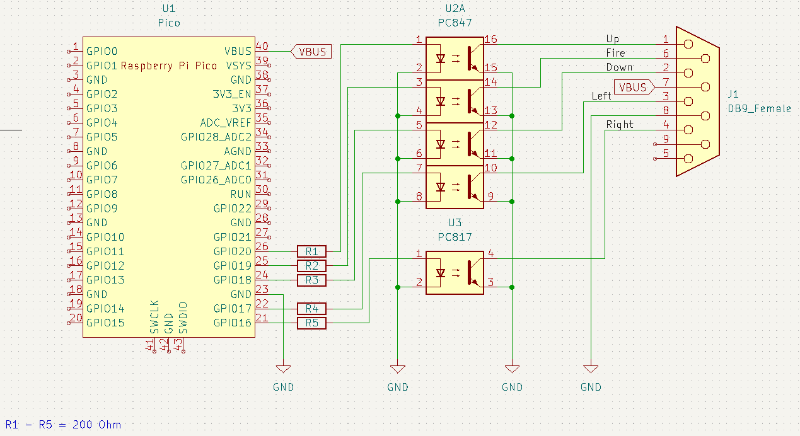

# picoC64USB
An adapter for connecting USB gamepads and mouses to a Commodore C64 through a Raspberry Pi Pico

*This is an early development version*

## supported input devices
- at the moment only XBox One Gamepads are supported

## Building:
```bash
git clone https://github.com/frankE/picoC64USB.git
cd picoC64USB
git submodule init
git submodule update --recursive
mkdir build && cd build
PICO_SDK_PATH=<PATH TO YOUR PICO SDK INSTALLATION> cmake ..
make
```

## Hardware
  
Pin definitions can be found under [src/pins.h](src/pins.h).  
The only tested mode at the moment is to connect the output pins via a opto-coupler to the C64.  
The analog inputs of the C64 are not supported at the moment.

## Default button mapping
D-Pad and left stick for joystick movements  
B-Button is fire; right trigger is autofire

Buttons can be changed through [src/config.h](src/config.h)
